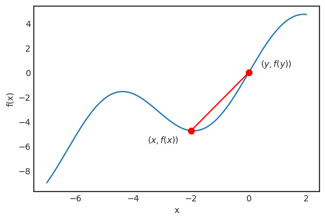
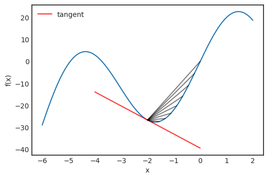
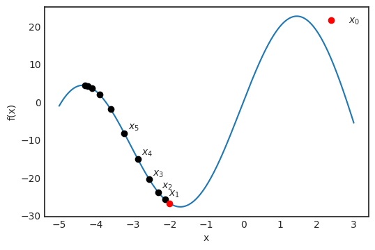
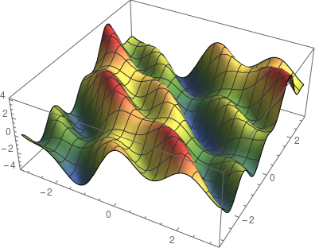
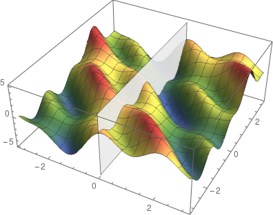
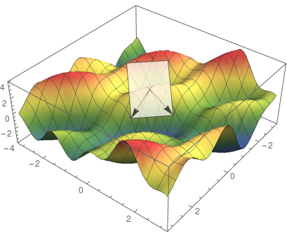
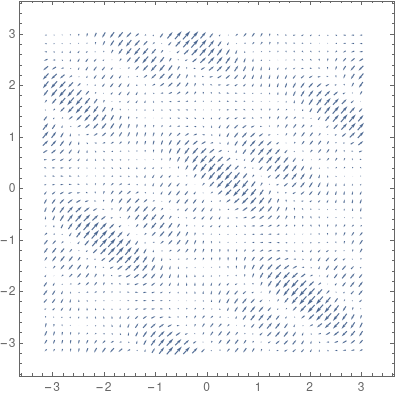
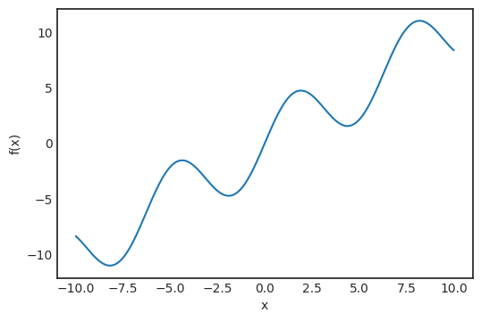
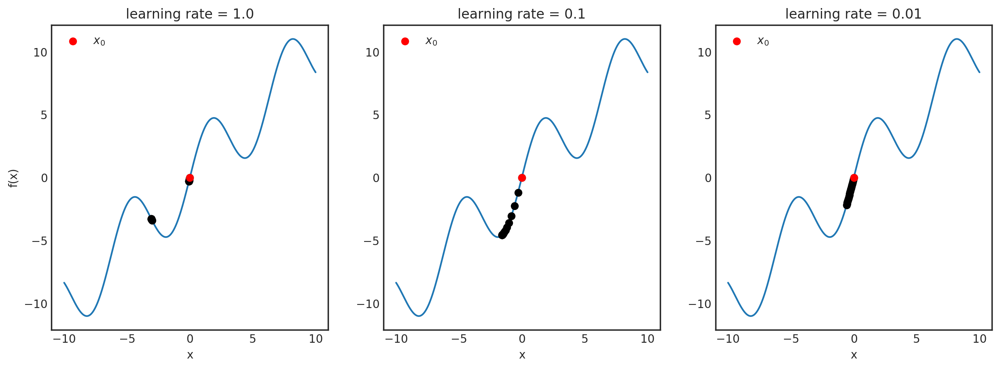
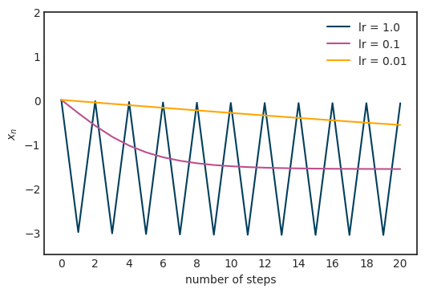

# The mathematics of optimization for deep learning

Based on a post @ [Towards Data Science](https://towardsdatascience.com/the-mathematics-of-optimization-for-deep-learning-11af2b1fda30).

### The basics of optimization

Let’s start simple and suppose that we have a function of one variable which we would like to maximize.

- In machine learning context, we generally aim to minimize the loss function, but minimizing is the same as maximizing the negative of the function.

Define:
$$
f(x) = 25\sin(x) - x^2
$$
Graph:

An obvious method to optimize would be to divide up the line into a grid, check the value of every point and select the one where the function is maximized.

- As we have seen in the introduction, this is not scalable, so we are going to look for another solution.

Let’s imagine that this is a mountain landscape and we are climbers, trying to reach the peak. Suppose that we are at the location marked with a red dot.

If we want to find the peak, which direction should we go?

- Of course, we should go where the slope is increasing.
- This concept is formalized by the *derivative* of a function.

Mathematically, the derivative is defined by:
$$
\displaystyle\frac{d}{dx}f(x) = f'(x) = \lim_{y \rightarrow x} \frac{f(x)-f(y)}{x-y}
$$
Let’s look at the function more closely around the point where we take the derivative.

For any $x$ and $y$, the line passing through $f(x)$ and $f(y)$ is defined by the equation:

$$
l(t) = \displaystyle\frac{f(x)-f(y)}{x-y} (t-x) + f(x)
$$
In general, if we have any line defined by $at + b$ for some $a$ and $b$, the quantity $a$ is called the *slope* of the line.

- This can be negative and positive as well, lines with positive slope go upward, while negative ones go downward.
- Higher values in absolute value mean steeper lines.

If we let $y$ closer and closer to $x$ as it is in the definition of derivative, we see that the line becomes the tangent of the function graph at $x$.

The tangent is given by the function:
$$
t(y) = f'(x)(y-x) + f(x)
$$
and its direction can be described with the vector $(1, f’(x))$.

If we imagine ourselves again into the position of a mountain climber starting from $x_0 = -2$, we should go in the direction where the tangent is rising.

- If the slope of the tangent is large, we would also like to take a large step, while if the slope is close to zero, we should take a smaller step to make sure we don’t go over the peak.

To formalize this mathematically, we should go to the next point defined by:
$$
x_1 := x_0 + \lambda f'(x_0)
$$
where $\lambda$ is a parameter, setting how large is the step should be in the right direction.

- This is called the *learning rate*.

In general, subsequent steps are be defined by:
$$
x_{n+1} = x_n + \lambda f'(x_n)
$$
Positive derivative means that the tangent is increasing thus we want to go forward, while negative derivative is a decreasing tangent, so we want to turn back. We can visualize this process:

As we can see, this simple algorithm successfully found a peak.

- However, this is not the global maximum of the function, which can be seen by looking at the image.
  - To get a little ahead of ourselves, this is a potential issue for a wide family of optimizing algorithms, but there are solutions for it.

In this simple case, we have only maximized a function of a single variable.

- This is useful to illustrate the concept, however, in real-life scenarios, millions of variables can be present.
  - For neural networks, this is definitely the case.

### Optimizing in multiple dimensions

For a function of a single variable, we could think about the derivative as the slope of the tangent line.

- However, for multiple variables, this is not the case.

Define the function:
$$
f(x,y) = \cos(3x+2y) + \cos(2x+4y) - 2\sin(x+y)
$$
Graph:

For functions of two variables, the graph is a surface.

- We immediately see that the concept of tangent line is not well defined, since we have many lines which are tangent to a given point in the surface.
- In fact, we have a whole plane of them.
  - This is called the *tangent plane*.

However, this tangent plane contains two very special directions.

- Suppose that we are looking at the tangent plane at $(0, 0)$.
- For every multi-variable function, fixing all but one variables is basically a function of single variable.

$$
f(x,0) = \cos(3x) + \cos(2x) - 2\sin(x) \\
f(0,y) = \cos(2y) + \cos(4y) - 2\sin(y)
$$

These functions can be visualized by slicing the surface with a vertical plane perpendicular to one of the axes.

- Where the plane and the surface meet is the graph of $f(x, 0)$ or $f(0, y)$, depending on which plane you use.

- Slicing the surface with a vertical plane to visualize $f(x,0)$:

For these functions we can define the derivatives as we have did in the previous section.

- These are called *partial derivatives* and they play an essential role in generalizing our peak finding algorithm from before.

To formalize it mathematically, they are defined by:
$$
\displaystyle\frac{\partial}{\partial x}f(x,y) = f_x (x,y) = \lim_{x_0 \rightarrow x} \frac{f(x,y) - f(x_0,y)}{x-x_0} \\
\displaystyle\frac{\partial}{\partial y}f(x,y) = f_y (x,y) = \lim_{y_0 \rightarrow y} \frac{f(x,y) - f(x,y_0)}{y-y_0}
$$
Each partial derivative represents a direction in our tangent plane.

The value of partial derivatives are the slopes of the special tangent lines. 

- The direction of steepest ascent is given by the *gradient*, which is defined by:

$$
\nabla f(x,y) = \Bigg(\displaystyle\frac{\partial}{\partial x}f(x,y),\frac{\partial}{\partial y}f(x,y)\Bigg)
$$

Note that the gradient is a direction in the parameter space.

- The gradients can be visualized in the two dimensional plane easily, which looks like the following in our case.

To summarize, the peak finding algorithm is now:
$$
\vec{x}_{n+1} = \vec{x}_n - \lambda\cdot\nabla f(\vec{x}_n)
$$
which is called *gradient ascent*.

If we want to find the minimum of a function, we would take a step in the direction of the negative gradient, which is the direction of steepest descent:
$$
\vec{x}_{n+1} = \vec{x}_n - \lambda\cdot\nabla f(\vec{x}_n)
$$
This version is called *gradient descent* and you have probably seen this one more frequently, since in machine learning, we actually want to minimize the loss.

### Why does the gradient point to the steepest ascent?

Besides slicing the surface with vertical planes perpendicular to the $x$ or $y$ axis, we can slice it with a vertical plane given by any direction $(a, b)$.

With the partial derivatives, we had:
$$
\displaystyle\frac{\partial}{\partial x}f(x,y) := \frac{d}{dt}f(x+t,y) \\
\displaystyle\frac{\partial}{\partial y}f(x,y) := \frac{d}{dt}f(x,y+t)
$$
We can think about these as derivatives of $f(x, y)$ along the directions $(1, 0)$ and $(0, 1)$.

Although these directions are of special significance, we can do this for any direction.

- Say we have the direction: $\vec{e} = (e_1, e_2)$.

- Then, the *directional derivative* with respect to this direction is defined by:
  $$
  \begin{align}
  \displaystyle\frac{\partial}{\partial \vec{e}}f(x,y) := &\ \frac{d}{dt} f(x+e_1 t, y + e_2 t) \\
  = &\ e_1 \frac{\partial}{\partial x} f(x,y) + e_2 \frac{\partial}{\partial y} f(x,y)
  \end{align}
  $$

Note that the last identity is nothing else than the dot product (also called scalar or inner product) of the direction vector and the gradient:
$$
\displaystyle\frac{\partial}{\partial \vec{e}} f(x,y) = \vec{e} \cdot \nabla f(x,y)
$$
The question is the following: which direction maximizes the directional derivative?

- This would be the direction of the steepest ascent, so if we want to optimize, we want to know this particular direction.

- To see that this is noting else than the gradient itself as we have mentioned, recall that the dot product can be written as:
  $$
  \vec{e} \cdot \nabla f(x,y) = |\vec{e}| |\nabla f(x,y)| \cos \alpha ,
  $$
  where $|\cdot|$ denotes the length of vector and $\alpha$ is the angle between the two vectors.

- It is easy to see that this expression is maximized when $\cos \alpha = 1$, that is, $\alpha$ is zero.

  - This means that the two vectors are parallel, thus the direction of $e$ must be the same as the gradient.

### Training neural networks

Suppose that our task is to classify images ($n$ dimensional feature vectors) into $c$ classes. 

- To mathematically formalize our situation, our neural network is represented by the function $f$, mapping the $n$-dimensional feature space to the $c$-dimensional space: $f:\R^n \mapsto \R^c$.

The neural network itself is a parametrized function.

- For notational convenience, we can denote its parameters with a single $m$-dimensional vector: $\vec{w} \in \R^m$.

- To explicitly express dependence on parameters, it is customary to write: $f(\vec{x},\vec{w})$.

- Training a neural network is equivalent of finding the minimum of the loss function $J:\R^m\mapsto \R$, mapping the space of neural network parameters to real numbers.

  - The loss function takes the form:
    $$
    J(\vec{w}) = \displaystyle\frac{1}{N}\sum_{i=1}^{N} L\big( f(\vec{x}^{(i)}, \vec{w}), \vec{y}^{(i)} \big)
    $$
    where $\vec{x}^{(i)}$ is the $i$-th data point, with observation $\vec{y}^{(i)}$, and $L$ is the term-wise loss function.

  - For instance, if $J$ is the cross-entropy loss, then $L\big(f(\vec{x}^{(i)}, \vec {w}), \vec{y}^{(i)} \big) = -\displaystyle\sum_{j=1}^{c} y_{j}^{(i)} \log f(\vec{x}^{(i)}, \vec{w})_j$.

### Stochastic gradient descent

To use gradient descent, we have to calculate:
$$
\nabla_{\vec{w}} J(\vec{w}) = \displaystyle\frac{1}{N} \sum_{i=1}^{N} \nabla_{\vec{w}} L\big( f(\vec{x}^{(i)}, \vec{w}), \vec{y}^{(i)} \big),
$$
which is computationally very intensive if $N$ is large, and $N$ is hopefully *very* large.

Notice that $J$ can be actually written as an *expected value*:
$$
\begin{align}
J(\vec{w}) = &\ \displaystyle\frac{1}{N} \sum_{i=1}^{N} L\big( f(\vec{x}^{(i)}, \vec{w}), \vec{y}^{(i)} \big) \\
= &\ \text{E}_{\hat{p}_{\text{data}}} \bigg[ L\big( f(\vec{x}^{(i)}, \vec{w}), \vec{y}^{(i)} \big) \bigg]
\end{align}
$$
where $\hat{p}_{\text{data}}$ is the (empirical) probability distribution given by our training data.

- We can treat the sequence $\bigg\{ L\big( f(\vec{x}, \vec{w}), \vec{y}^{(i)} \big) \bigg\}_{i=1}^{N}$ as independent, identically distributed random variables.
- According to the Law of Large Numbers, $\displaystyle\lim_{N\rightarrow\infty} \text{E}_{\hat{p}_{\text{data}}} \Big[ \nabla_{\vec{w}} L\big(f(\vec{x}^{(i)}, \vec{w}), \vec{y}^{(i)} \big) \Big] = \text{E}_{p_{\text{data}}} \Big[ \nabla_{\vec{w}} L\big(f(\vec{x}^{(i)}, \vec{w}), \vec{y}^{(i)} \big) \Big]$ holds, where $p_{\text{data}}$ is the true underlying distribution (unknown).
  - This means that as we increase our training data, our loss function converges to the true loss.
  - As a consequence, if we subsample our data and only calculate the gradient $\nabla_{\vec{w}} L \big( f(\vec{x}^{(i)}, \vec{w}), \vec{y}^{(i)} \big)$ for some $i$ instead of all, we still obtain a reasonable estimate if we compute enough.
  - This is called *stochastic gradient descent* or SGD in short.

As with almost every new approach, SGD also introduces a whole new can of worms.

- The obvious question is, how large should our subsample size be?
  - Too small size might result in a noisy gradient estimation, while too large has diminishing returns.
- Selecting the subsample also needs to happen with care.
  - For example if all the subsamples belong to one class, the estimate will probably be off by a mile.
- However, these issues can be solved in practice by experimentation and proper randomization of the data.

### Improving gradient descent

Gradient descent (with the SGD variant as well) suffers from several issues which can make them ineffective under some circumstances.

- For instance, as we have seen, learning rate controls the step size we will take in the direction of the gradient.
  - Generally, we can make two mistakes regarding this parameter.
    1. We can make the step too large so the loss fails to converge and might even diverge.
    2. If the step is too small, we might never arrive to a local minimum, because we go too slow.
  - To demonstrate this issue, let’s take a look at a simple example and study the $f(x) = x+ \sin x$ function.

Suppose that we start the gradient descent from $x_0 = 2.5$, with learning rates $\alpha = 1$, $\alpha = 0.1$ and $\alpha = 0.01$.

It might not be obvious what is happening here, so let’s plot the $x$'s for each learning rate.

- For $\alpha = 1$, the sequence is practically oscillating between two points, failing to converge to the local minimum.
- For $\alpha = 0.01$, the convergence seems to be very slow.
- In our concrete case, $\alpha = 0.1$ seems just right.

How do you determine this in a general setting?

- The main idea here is that the learning rate does not necessarily have to be constant. 
  - Heuristically, if the magnitude of the gradient itself is large, we should reduce the learning rate to avoid jumping too far.
  - On the other hand, if the magnitude is small, it probably means that we are getting close to a local optimum, so to avoid overshooting, the learning rate definitely shouldn’t be increased.
  - Algorithms changing the learning rate dynamically are called *adaptive*.

One of the most popular examples of such an adaptive algorithm is [AdaGrad](https://medium.com/konvergen/an-introduction-to-adagrad-f130ae871827).

- It cumulatively stores gradient magnitude and scales the learning rate with respect to that.
- AdaGrad defines an accumulation variable $r_0 = 0$ and updates it with the rule $\vec{r}_{n+1} = \vec{r}_n + \nabla_{\vec{w}} J\ \odot\ \nabla_{\vec{w}} J$, where $\vec{u} \odot \vec{v} = (u_1 v_1, u_2 v_2, ..., u_n v_n)$ denotes the [component-wise product](https://en.wikipedia.org/wiki/Hadamard_product_(matrices)) of two vectors.
- This is then used to scale the learning rate $\vec{w}_{n+1} = \vec{w}_n - \displaystyle\frac{\lambda}{\delta + \sqrt{\vec{r}_{n+1}}} \nabla_{\vec{w}} J$, where $\delta$ is a small number for numerical stability and the square root is taken component-wise.
  - First, when the gradient is large, the accumulation variable grows rather fast thus decreasing the learning rate.
  - When the parameter is near a local minimum, gradients get smaller so the learning rate decrease practically stops.

